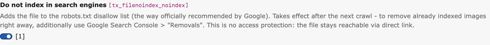
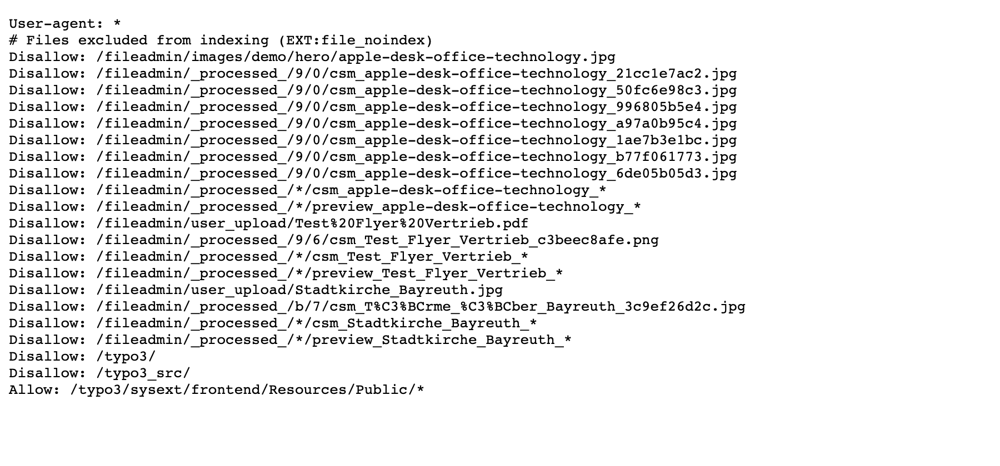

# File No-Index — exclude single files from search engines

TYPO3 extension `file_noindex` · Composer `bm1/file-noindex` · TYPO3 v13 + v14 · GPL-2.0-or-later

Editors can exclude **any file** (images of all kinds, PDFs, …) from search
engine indexing directly in the **File list** module — one checkbox in the
file metadata, no developer involved, no matter where the file is used.

The extension serves a dynamically generated `robots.txt` that contains
`Disallow` entries for every marked file — the original file **plus** its
processed variants (`csm_…`, `preview_…`). Blocking via robots.txt is the
[way officially recommended by Google](https://developers.google.com/search/docs/crawling-indexing/prevent-images-on-your-page)
to keep images out of Google Image Search.

## Typical use case

A person on a team photo asks not to appear in Google Image Search. Instead
of touching templates or moving files, an editor opens the file's metadata,
checks *"Do not index in search engines"*, saves — done. The next time
crawlers fetch `robots.txt`, the file and all its rendered variants are
disallowed.

## Installation

### Composer mode

```bash
composer require bm1/file-noindex
```

### Classic mode

Install `file_noindex` from the TYPO3 Extension Repository (TER) via the
Extension Manager.

After installation run a database schema update ("Analyze Database
Structure" in the Maintenance module or `vendor/bin/typo3
database:updateschema`). No further configuration is needed.

## Usage

1. Open the **File list** module and edit the metadata of a file
   (or open the file resource in the Media module).
2. Switch to the **SEO** tab, enable **"Do not index in search engines"**
   and save.

   
3. `https://your-site.example/robots.txt` now contains the `Disallow`
   entries — immediately, no cache flush needed:

```
User-agent: *
# Files excluded from indexing (EXT:file_noindex)
Disallow: /fileadmin/team/group-photo.jpg
Disallow: /fileadmin/_processed_/9/0/csm_group-photo_a97a0b95c4.jpg
Disallow: /fileadmin/_processed_/*/csm_group-photo_*
Disallow: /fileadmin/_processed_/*/preview_group-photo_*
Disallow: /typo3/
```

Unchecking the box removes the entries just as immediately.



## How it works

A PSR-15 middleware answers `GET /robots.txt` in the frontend stack —
after site resolution, before TYPO3's static route resolver:

- **Base rules** are taken from the site configuration's `robots.txt`
  route (`type: staticText`), so your site config stays the single place
  to maintain them. Without such a route a minimal `User-agent: *` group
  is used.
- **Disallow entries** for all marked files are inserted into the last
  existing `User-agent: *` group (not appended as a duplicate group —
  not all parsers merge groups of the same name). Listed per file:
  1. the original file path,
  2. all currently existing processed variants (`sys_file_processedfile`),
  3. wildcard patterns (`csm_<name>_*`, `preview_<name>_*` inside the
     storage's processing folder) covering variants that will be
     generated in the future.
- Only files from **local, public** storages are listed. Renamed or moved
  files are reflected automatically on the next robots.txt request.
- The response is generated live on every request (`Cache-Control:
  public, max-age=3600`). robots.txt is requested rarely; one indexed
  query per request is uncritical and checkbox changes take effect
  immediately without any cache invalidation logic.

## Limits — please read

- **No access protection.** The file stays reachable via direct link.
  robots.txt only affects crawlers that respect it (Google, Bing, …).
  If you need hard protection, look at
  [EXT:fal_protect](https://extensions.typo3.org/extension/fal_protect).
- **Already indexed images** disappear only after the next crawl (days to
  weeks). For immediate removal additionally use Google Search Console →
  *Removals*.
- **Deliberate over-blocking by wildcards.** `csm_photo_*` also matches
  variants of a file named `photo_2.jpg`. When in doubt the extension
  blocks too much rather than too little.
- **Specific user-agent groups win.** If your robots.txt contains a more
  specific group such as `User-agent: Googlebot-Image`, that crawler
  ignores the `User-agent: *` group entirely — including our entries.
  In that case replicate the disallows in the specific group or remove it.
- **robots.txt size limit.** Google reads robots.txt only up to 500 KiB.
  With roughly three lines per file this allows thousands of marked files;
  if you get anywhere near that, reconsider your setup.
- **Multi-site installations sharing one fileadmin** list all marked files
  in the robots.txt of **every** site. Over-blocking across hosts is
  accepted in favour of a simple and robust v1.
- **Language-independent.** The checkbox lives on the default-language
  metadata record and applies to the file as such (`l10n_mode=exclude`).

## Development

```bash
composer update
composer test:unit
typo3DatabaseDriver=pdo_sqlite composer test:functional
composer check:cs
composer check:phpstan
```

Issues and source: <https://github.com/BM1-de/file_noindex>

## License

GPL-2.0-or-later, see [LICENSE](LICENSE).
